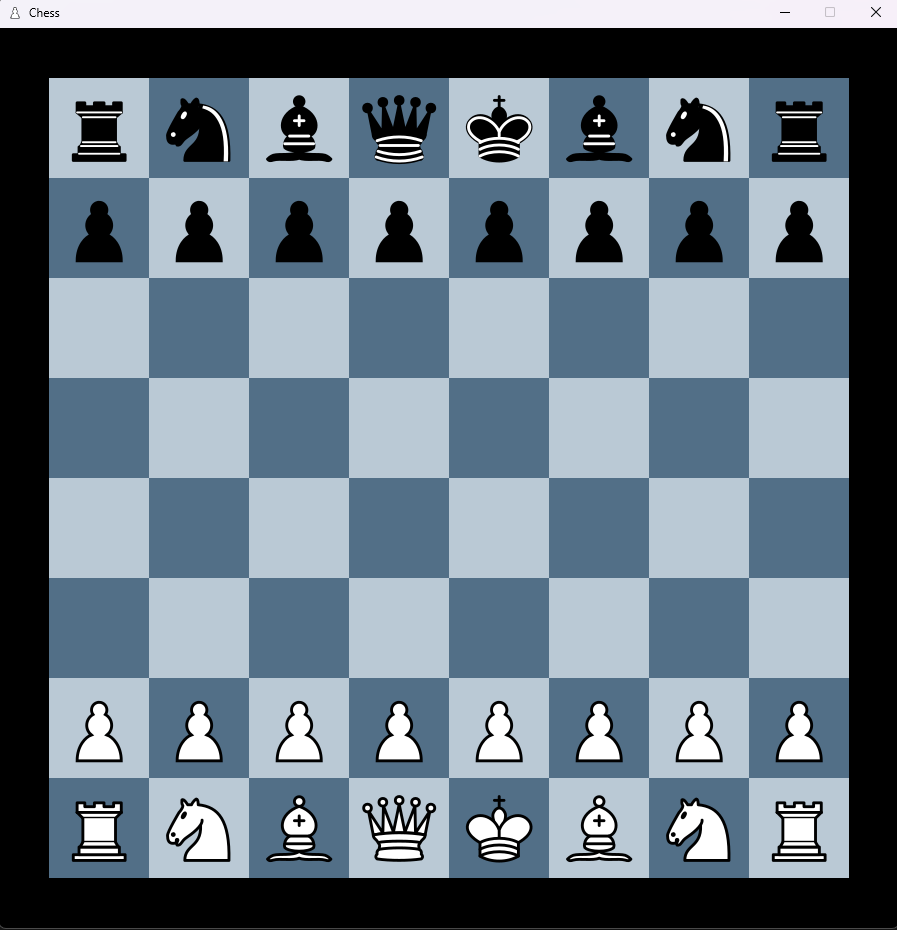
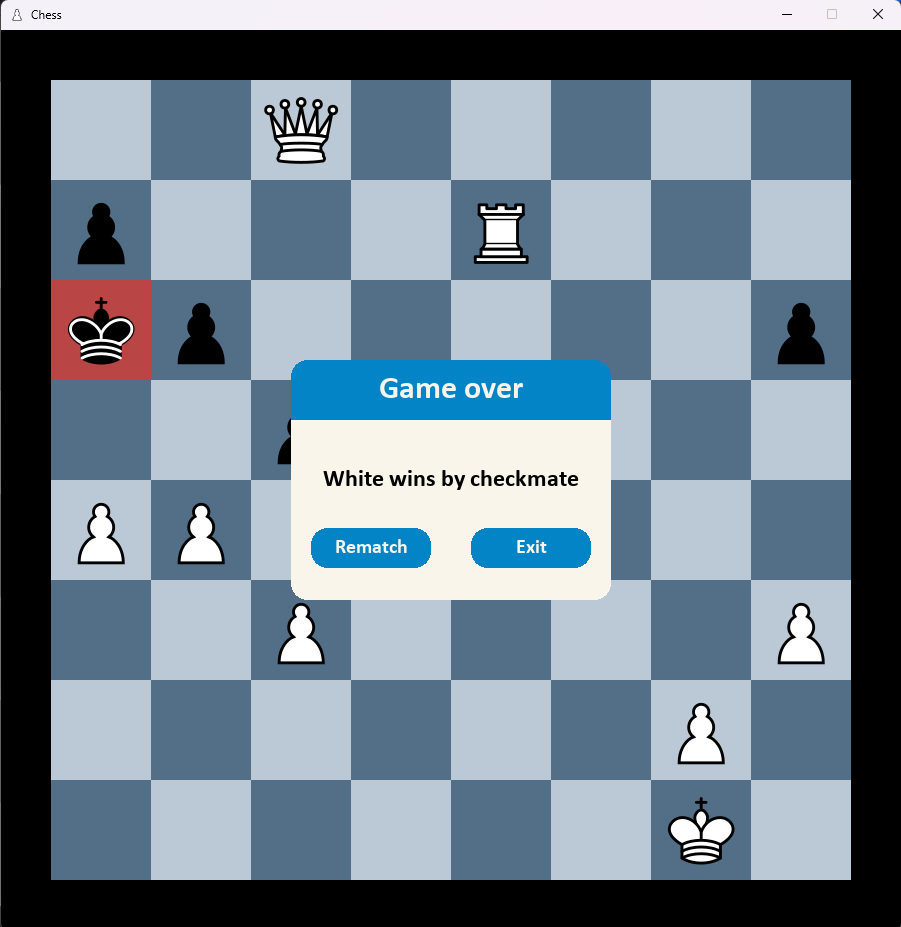

# Chess game
A chess game made for my Computer Networks class that allows to play chess in the same network by multiple users at the same time. Application consists of a client and a server that commmunicate using the TCP protocol.

Server is written in C for a Linux system and can hold up to three games at a time. Client is written in Python with the Pygame module used to create GUI. Chess engine is written by me.

User controls the pieces by dragging them to a selected place.





# Setup
To run the server:
```
gcc main.c -o server -lpthread
```
To run the client:

Install the pygame module:
```
pip install pygame
```
Run the app:

```
python main.py SERVER_IP_ADDRESS
```